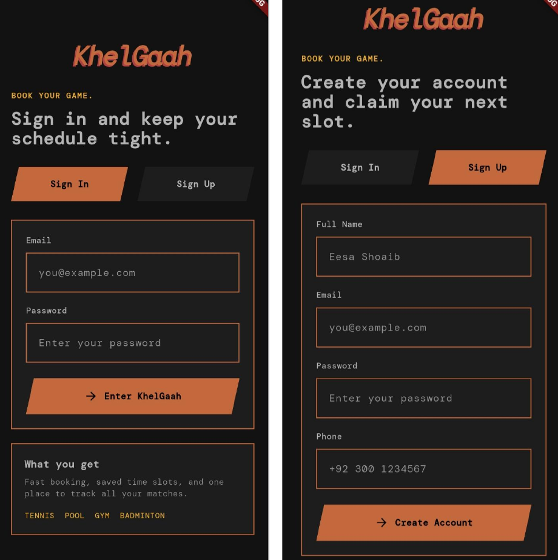
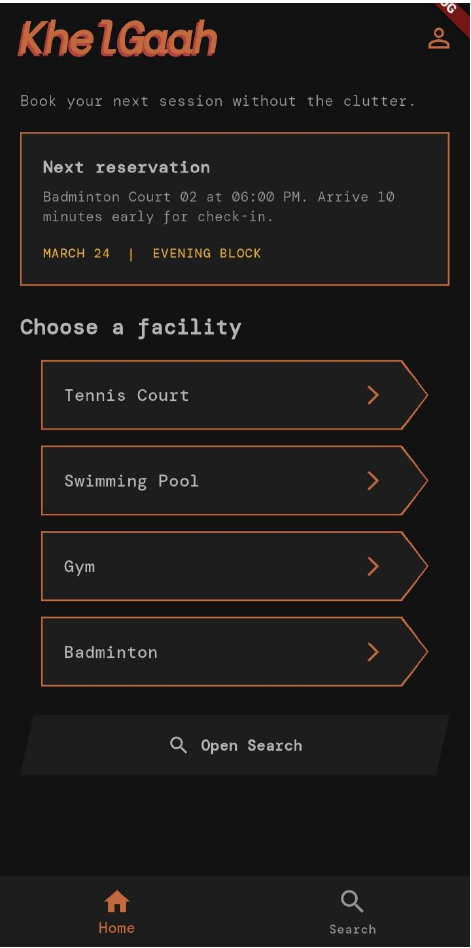
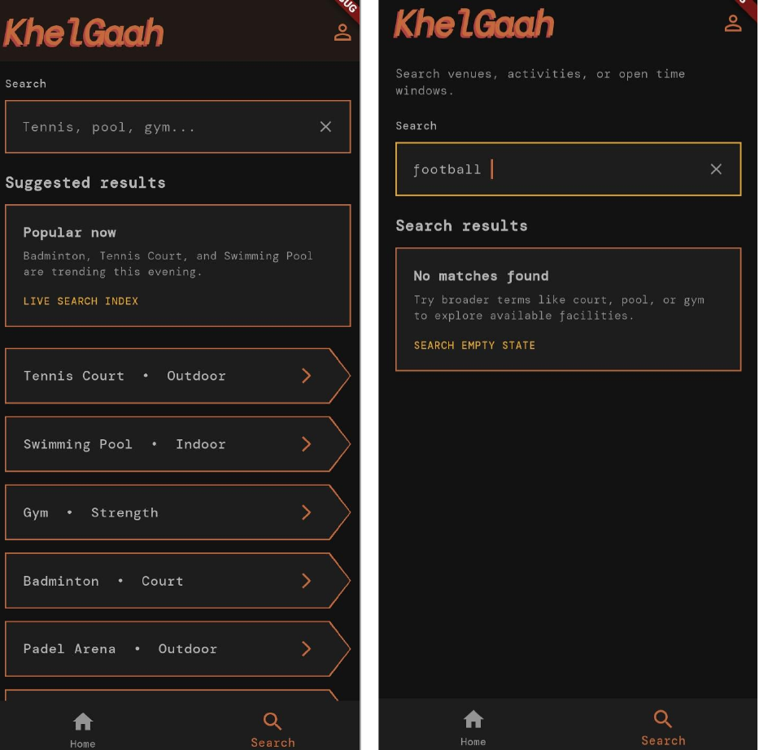

# Khelgaah Sprint Backlog — Sprint 2

## Context

Sprint 1 delivered the Khelgaah frontend UI shell in Flutter, including the authentication flow, home dashboard, search flow, booking screens, profile screen, shared widgets, and app theme.  
Sprint 2 should build on that work by developing the first backend module set needed to turn the UI prototype into a working client-server product.

## A. Module Selected for Sprint 2

**Module Name:** `Khelgaah Backend 1 — Core API and Booking Engine Foundation`

This Sprint 2 module focuses on the first production backend slice required to support the Sprint 1 frontend:

- authentication APIs
- current-user profile API
- venue and facility discovery APIs
- facility availability API
- booking creation and booking history APIs
- PostgreSQL persistence and conflict-safe booking logic

## Sprint Goal

Deliver the first backend vertical slice so the frontend built in Sprint 1 can begin consuming real APIs for login, discovery, availability lookup, and booking.

## B. User Stories Selected for Sprint 2

### US-06 — Backend Authentication and Session API

| Field | Detail |
| --- | --- |
| User Story ID | `US-06` |
| Title | Backend Authentication and Session API |
| As a | new or returning user |
| I want to | register, log in, and retrieve my authenticated profile through backend APIs |
| So that | the Sprint 1 frontend can use real authentication instead of static navigation |
| Priority | High |
| Story Points | 8 |

**Sub User Stories**

- `US-06a`: As a new user, I want a `POST /api/v1/auth/signup` endpoint so that my account can be created in PostgreSQL.
- `US-06b`: As a returning user, I want a `POST /api/v1/auth/login` endpoint so that I can sign in with valid credentials.
- `US-06c`: As a user, I want my password to be hashed securely before storage so that my account is protected.
- `US-06d`: As an authenticated user, I want a signed bearer token so that I can access protected APIs.
- `US-06e`: As an authenticated user, I want a `GET /api/v1/me` endpoint so that the frontend can show my profile details.
- `US-06f`: As a client developer, I want consistent auth error responses so that the frontend can handle invalid credentials and unauthorized access correctly.

### US-07 — Venue and Facility Discovery API

| Field | Detail |
| --- | --- |
| User Story ID | `US-07` |
| Title | Venue and Facility Discovery API |
| As a | authenticated player |
| I want to | load venues and searchable facilities from backend APIs |
| So that | the home and search screens can display real discovery data |
| Priority | High |
| Story Points | 5 |

**Sub User Stories**

- `US-07a`: As a user, I want a `GET /api/v1/venues` endpoint so that the app can display available venues.
- `US-07b`: As a user, I want a `GET /api/v1/facilities` endpoint so that I can browse bookable facility types.
- `US-07c`: As a user, I want facility search filtering by name or sport so that I can quickly find what I need.
- `US-07d`: As a frontend developer, I want consistent JSON response shapes for venues and facilities so that screen rendering stays predictable.
- `US-07e`: As a developer, I want the discovery endpoints backed by seed data so that Sprint 1 UI flows can be demonstrated end-to-end.

### US-08 — Availability Lookup API

| Field | Detail |
| --- | --- |
| User Story ID | `US-08` |
| Title | Facility Availability Lookup API |
| As a | authenticated player |
| I want to | request available slots for a facility by date and duration |
| So that | I can choose a valid time before creating a booking |
| Priority | High |
| Story Points | 5 |

**Sub User Stories**

- `US-08a`: As a user, I want a `GET /api/v1/facilities/{facilityID}/availability` endpoint so that I can view open slots.
- `US-08b`: As a user, I want the system to validate `facilityID`, `date`, and `duration` so that invalid requests fail clearly.
- `US-08c`: As a user, I want slots to be generated from operating hours and existing bookings so that availability is reliable.
- `US-08d`: As a frontend developer, I want unavailable slots to be clearly marked in the response so that the booking screen can render disabled options.
- `US-08e`: As a developer, I want availability logic covered by service tests so that regressions are caught early.

### US-09 — Booking Creation and Booking History API

| Field | Detail |
| --- | --- |
| User Story ID | `US-09` |
| Title | Booking Creation and Booking History API |
| As a | authenticated player |
| I want to | reserve a facility slot and review my bookings through backend APIs |
| So that | the booking flow from Sprint 1 becomes a real transactional feature |
| Priority | High |
| Story Points | 8 |

**Sub User Stories**

- `US-09a`: As a user, I want a `POST /api/v1/bookings` endpoint so that I can submit a booking request.
- `US-09b`: As a user, I want the system to reject overlapping reservations so that double-booking cannot occur.
- `US-09c`: As a user, I want booking creation to happen inside a database transaction so that writes remain consistent.
- `US-09d`: As a user, I want a `GET /api/v1/bookings` endpoint so that I can view my booking history.
- `US-09e`: As a frontend developer, I want booking conflict errors to return a clear `409`-style response so that the UI can guide the user to another slot.
- `US-09f`: As a developer, I want booking validation and conflict handling tested so that the booking engine is safe under normal use.

### US-10 — Sprint 1 Frontend-to-Backend Integration

| Field | Detail |
| --- | --- |
| User Story ID | `US-10` |
| Title | Frontend-to-Backend Integration Foundation |
| As a | Khelgaah user |
| I want to | use the Sprint 1 frontend against real backend endpoints |
| So that | the application moves from UI prototype to working MVP foundation |
| Priority | Medium |
| Story Points | 3 |

**Sub User Stories**

- `US-10a`: As a developer, I want the auth screen wired to signup and login APIs so that authentication is real.
- `US-10b`: As a developer, I want the home and search screens wired to venue and facility APIs so that static lists can be replaced.
- `US-10c`: As a developer, I want the booking screen wired to availability and booking APIs so that slot selection uses backend truth.
- `US-10d`: As a developer, I want a minimal frontend data layer for HTTP calls and DTO mapping so that API logic does not leak into widgets.

## Proposed Sprint 2 Backlog Order

1. `US-06` Backend Authentication and Session API
2. `US-07` Venue and Facility Discovery API
3. `US-08` Availability Lookup API
4. `US-09` Booking Creation and Booking History API
5. `US-10` Frontend-to-Backend Integration Foundation

**Total Planned Story Points:** `29`

## Definition of Done for Sprint 2

- backend endpoints compile and run locally
- PostgreSQL schema and seed data support the selected stories
- protected endpoints require authentication
- booking creation prevents overlapping active bookings
- frontend can call the implemented APIs for at least one end-to-end happy path
- basic tests exist for auth, availability, and booking services
- docs are updated to reflect delivered routes and payloads

## C. Trello Board Update

The workspace does not have Trello access, so the actual board could not be updated from here.  
This is the exact Sprint 2 update set that should be mirrored on the board:

### Lists to Maintain

- `Product Backlog`
- `Sprint 2 To Do`
- `Sprint 2 In Progress`
- `Sprint 2 Review / Testing`
- `Sprint 2 Done`

### Cards to Add to `Sprint 2 To Do`

- `US-06 Backend Authentication and Session API`
- `US-07 Venue and Facility Discovery API`
- `US-08 Availability Lookup API`
- `US-09 Booking Creation and Booking History API`
- `US-10 Frontend-to-Backend Integration Foundation`

### Suggested Checklist Items Per Card

- API route defined
- request/response contract documented
- service logic implemented
- repository/data access implemented
- validation and error handling added
- test coverage added
- frontend integration verified where applicable

### Dependencies to Note on the Board

- `US-10` depends on `US-06`, `US-07`, `US-08`, and `US-09`
- `US-09` depends on `US-08`
- `US-08` depends on facility and booking data being available in PostgreSQL

## D. Sprint 1 Frontend Screenshots

These screenshots are included as evidence of the completed Sprint 1 frontend work that Sprint 2 will build upon.

### 1. Authentication Screens

### 2. Home Dashboard Screen

### 3. Search Screen

## Notes

- Sprint 1 established the frontend structure and user journey.
- Sprint 2 should focus on backend correctness first, especially authentication, availability calculation, and double-booking prevention.
- The `US-10` integration story is intentionally kept small because the main development focus of Sprint 2 is the backend module.
